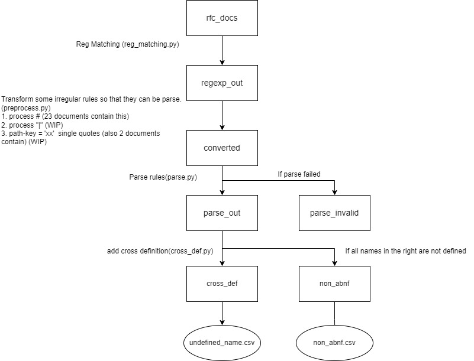

# ABNF Extractor
This is the repo for extracting ABNF rules from RFC documents. The flowchart for the extraction process is below.

1. Download all RFC doc from website and save it (download.py)
2. Using regexp to extract what looks like abnf in RFC doc (reg_matching.py)
3. Preprcess the rules extracted in step 2 (preprocess.py)
4. Parse every rules and discard the rule that cannot be parsed (parse.py).
5. Add cross definition in every document. (cross_def.py)

# Setting the environment
To install the required package, run:

    pip install -r requirements.txt

# Run steps:

1. Download RFC document:

        python download.py

    The downloaded files is in `abnf/rfc_docs` 

2. Regexp Matching

        python reg_matching.py

    The matching result is in `abnf/regexp_out`

3. Parsing rules:

        python parse.py

    The rules that can be parsed is in `abnf/parse_out`, the rules that cannot be parsed is in `abnf/parse_invalid`

4. Add external definition:

        python cross_def.py
    